# Отчет по лабораторной работе 1

1.  ## Задание 1.

    1.  > Перейдите в домашний каталог
    2.  > Создайте каталоги D1/D2/D3.
    3.  > В каталоге D2 создайте обычный пустой файл file.txt.

        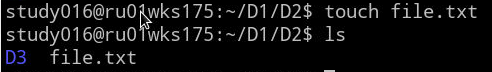
    4.  > Добавьте текст в файл file.txt.

        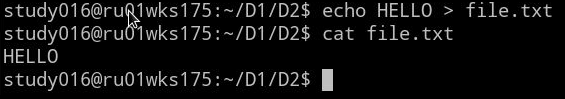
    5.  > В каталоге D3 создайте символическую и жесткие ссылки на file.txt.
        > Докажите, что ссылки созданы успешно.

        1.  Создадим ссылки.

            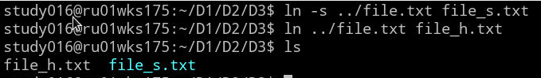
        1.  Получим информацию о `file_s.txt` с помощью команды `stat`.

            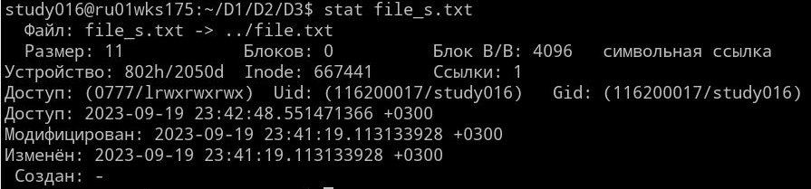
        1.  Получим информацию о `file_h.txt` с помощью команды `stat`.

            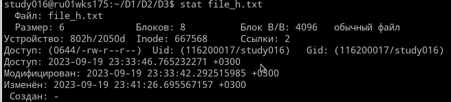
        1.  Получим информацию о `../file.txt` с помощью команды `stat`.

            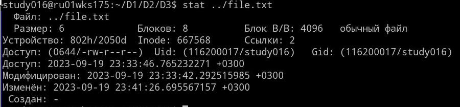

            Можем заметить, что у файлов `file_h.txt` и `../file.txt` один `inode`.
            Следовательно это один и тот же файл.
            У `file_s.txt` другой `inode`.

        1.  Проверим содержимое ссылок:

            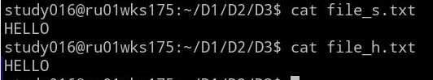
    6.  > Переместите файл file.txt в каталог D1.
        > Проверьте, что ранее созданные ссылки на этот файл работают.

        1.  Переместим файл:

            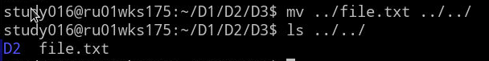
        1.  Символическая ссылка не работает:

            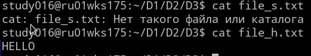

            Не работает, потому что она продолжает ссылаться на `../file.txt`:

            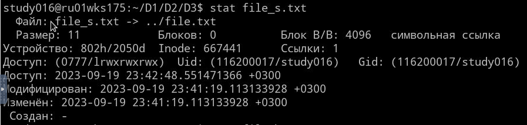
    7.  > Удалите каталог D2 со всем содержимым.

        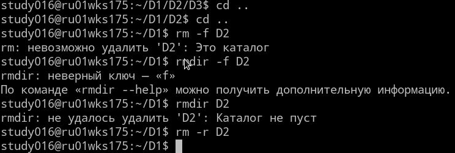

2.  ## Задание 2.

    1.  > Найдите все файлы в системе размером больше 50МБ.
        > Убедитесь в том, что найденные файлы имеют нужный размер.

        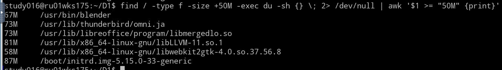
    2.  > В домашнем каталоге и его подкаталогах найдите обычные файлы, 
        > которые были изменены в течение последних 24х часов.

        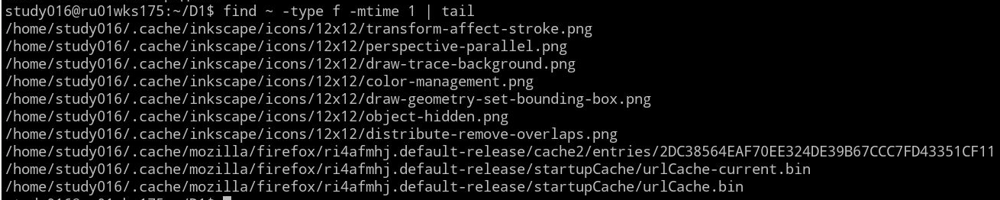
    3.  > В каком каталоге находится команда find?

        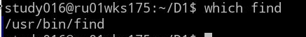
    4.  > Что можно сказать о файле find по характеру его содержимого?

        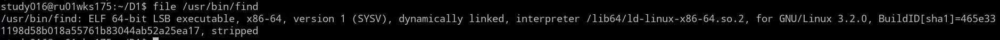

        Что этот файл - `ELF 64bit executable`.
    5.  > Установите, к какому типу относятся файлы /boot/initrd.img*.

        Результат `stat`:

        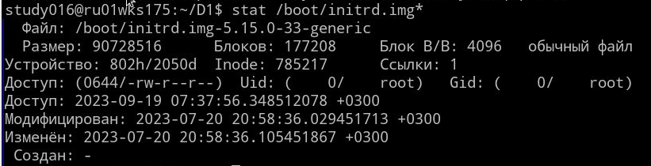

        *Обычный файл*.

        Результат `file`:

        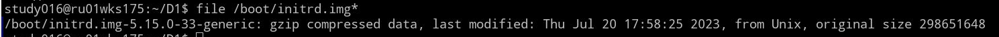

        *gzip compressed*

3.  ## Задание 3.

    1.  > Выведите содержимое журнального файла auth.log в постраничном режиме.
        > Найдите в этом журнальном файле сообщения от подсистемы sudo.

        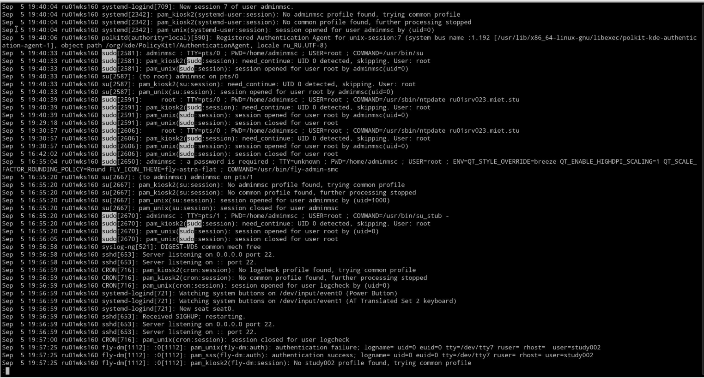
    2.  > Выведите содержимое журнального файла auth.log в постраничном режиме так,
        > чтобы сначала выводились последние записи.

        Воспользуемся командами `tac`, `less`:

        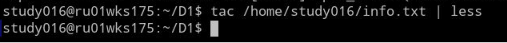

        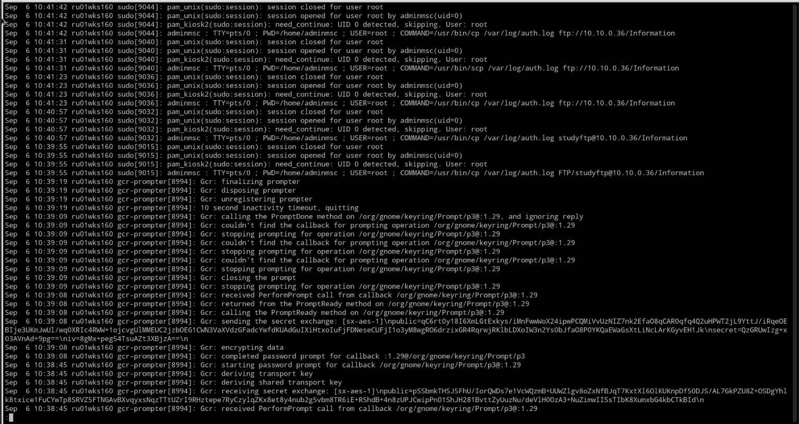
    3.  > Выведите на экран имя текущего каталога и список файлов в этом каталоге.
        > Введите соответствующие команды в одной строке.

        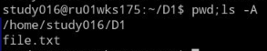
    4.  > Используя предыдущее задание, сохраните имя текущего каталога и список файлов в этом каталоге в файл cur_dir_files.txt.
        > Проверьте успешность выполнения команды.

        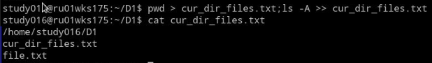

4.  ## Задание 4.

    1.  > Перейдите в домашний каталог.
        > Выведите на экран информацию о подкаталогах текущего каталога командой ls -l | grep '^d'.
        > Используя команды tr и cut, отставьте в выводе на экран только имена подкаталогов.
        > Примечание: используйте параметр -s команды tr, который удаляет последовательности повторяющихся символов, указанных в команде.

        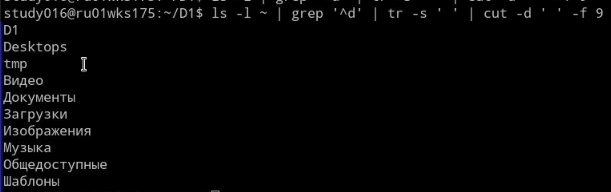

    2.  > Усовершенствуйте предыдущее задание, выводя все имена подкаталогов в одной строке.
        > Используйте команду tr.

        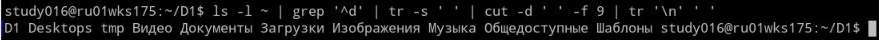
    3.  > Добавьте эту строку с именами каталогов в файл cur_dir_files.txt.

        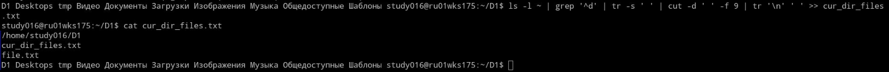
    4.  > Посчитайте количество различных комбинаций прав доступа,
        > установленных на файлы и каталоги, которые находятся в /dev.
        > Используйте команды ls, tr, cut, sort, uniq.

        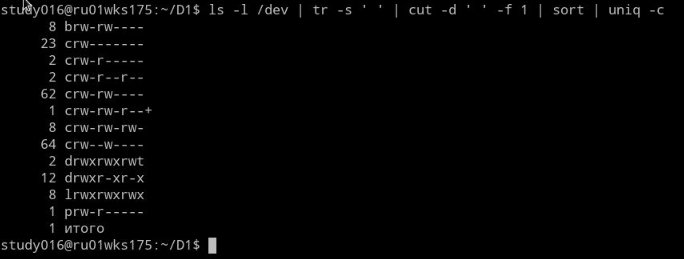
5.  ## Задание 5.
    1.  ### Задания на использование регулярных выражений и утилиты grep:
        1.  > пользуясь справочной системой man, выведите список всех пользовательских и административных команд, начинающихся с ls;

            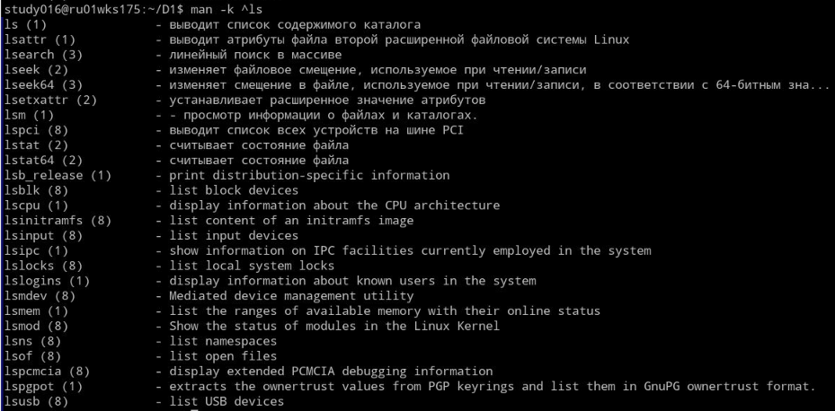
        2.  > из файла /var/log/messages вывести строки за вчерашний день с 1 am до 5pm.

            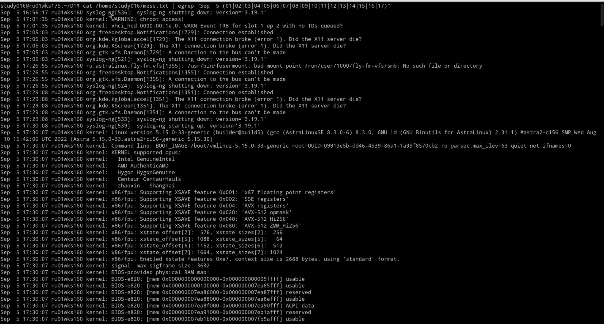
    2.  ### Задание на использование утилиты sed
        1.  > в файлах .bashrc, находящихся в домашних каталогах пользователей (/home),
            > изменить определение переменной LD_LIBRARY_PATH 
            > (в переменную должен быть добавлен каталог /opt/rubackup/lib, определение переменной разместить в конце файлов).

            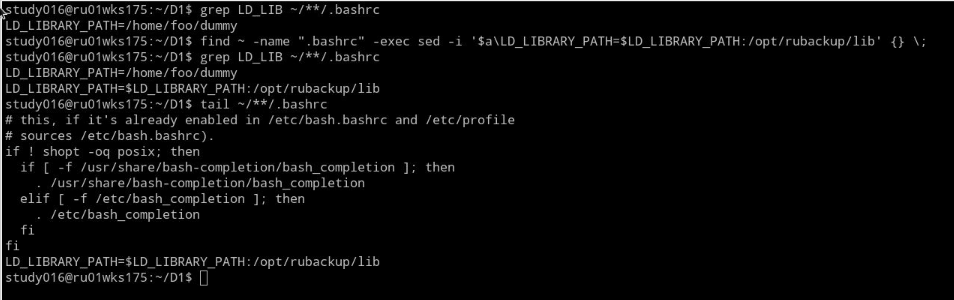
    3.  ### Задание на использование утилиты awk
        1.  > в домашнем каталоге создайте каталог temp и перейдите в него;

            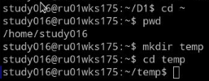
        2.  > создайте файлы file1.txt, file2.txt, …, file20.txt

            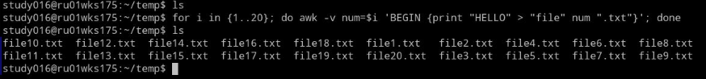
    4.  ### (Подсказка: воспользуйтесь механизмом генерации строк с помощью фигурных скобок);
        1.  > создайте подкаталог bak;
        2.  > скопируйте файлы file1.txt, file2.txt, … , file20.txt в каталог bak
            > с именами file1.txt.bak, file2.txt.bak, …, file20.txt.bak, используя awk.

            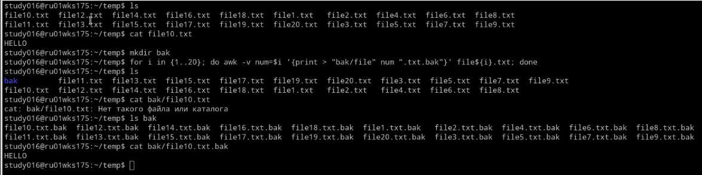
