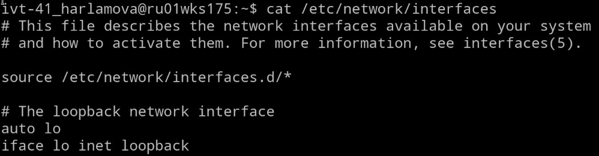

# Лабораторная работа 2

***[TOC]***

---

2.  ## Задание 2.

    > Проанализируйте файл /etc/network/interfaces. Что содержится в нем?

    

    Содержится только информация о *loopback* интерфейсе (127.x.x.x)

    `auto lo` - bring up on boot up

3.  ## Задание 3.

    > Проверьте соединение между клиентом и сервером.

    
