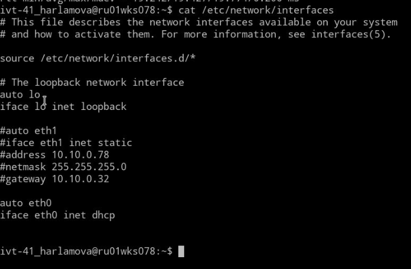
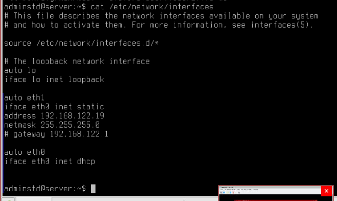

# Лабораторная работа №4. АЛВС

1.  ## Запуск виртуальных машин

    2.  Убедимся, что у главной машины есть доступ к интернету с помощью `ping`. Если нет доступа, то подключить
        другой интерфейс с *auto dhcp* через `/etc/network/interfaces`

        лук:

        

        На сервере добавим 2ой интерфейс с *auto dhcp*:

        

        Проверим пингом.
