# Лабораторная работа №4. АЛВС

1.  ## Запуск виртуальных машин

    1.  > Запустите и настройте виртуальные машины в соответствии с п. 1 и 2
        > практической работы предыдущей лабораторной работы.

    2.  > Настройте сетевые интерфейсы следующим образом: server – два
        > интерфейса, один для связи со второй машиной, второй для доступа в
        > интернет, client – один интерфейс для связи с сервером.

        Убедимся, что у *главной* машины есть доступ к интернету с помощью `ping`. Если нет доступа, то подключить
        другой интерфейс с *auto dhcp* через `/etc/network/interfaces`

        лук:

        

        На *сервере* добавим 2ой интерфейс с *auto dhcp*:

        

        Проверим пингом.

2.  ## Прокси сервер SQUID

    1.  > Установите и проверьте работоспособность прокси сервера SQIUID на обоих машинах.

        На *клиенте* откроем *firefox* и настроим прокси:

        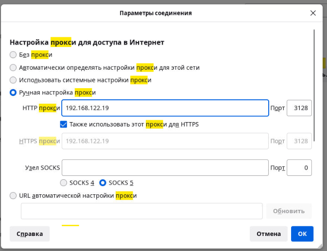

        На *сервере* сначала забакапим:

        ```bash
        sudo cp /etc/squid/squid.conf /etc/squid/squid.conf.bak
        ```

        Настроим конфиг:

        ```bash
        sudo nano /etc/squid/squid.conf
        ```

        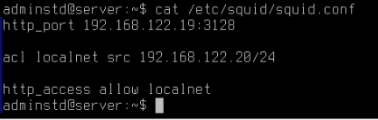

        Зарестартим *squid*:

        ```bash
        sudo systemctl restart squid
        ```

        Убедимся, что *squid* работает на *сервере*:

        ```bash
        curl -x http://192.168.122.19:3128 -I -L http://google.com
        ```

        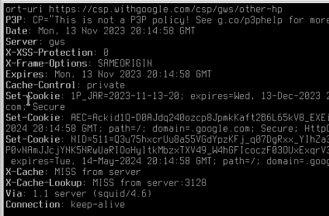

        Убедимся, что *squid* работает на *сервере*:

        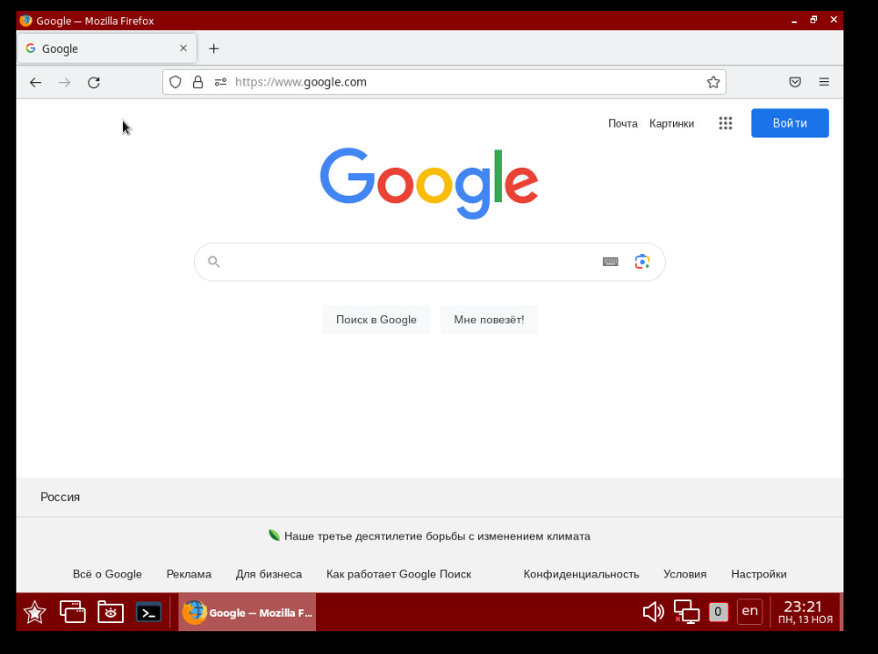

    2.  >  Настройте прокси сервер на сервере таким образом, чтобы был ограничен доступ к сайту
        >  YouTube и vk.com в рабочее время, а остальные сайты запускались свободно

        Добавим блокировки на *сервер*:

        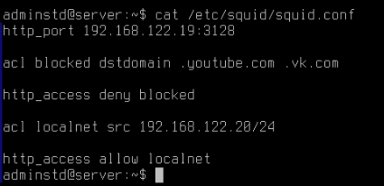

    3.  > Перечитайте измененный конфигурационный файл

        ```bash
        sudo systemctl reload squid
        ```

    4.  > Убедитесь в том, что подключение из-под клиента идет через прокси сервер. Для этого
        > запустите браузер firefox, внесите необходимые изменения и откройте любую веб страницу

        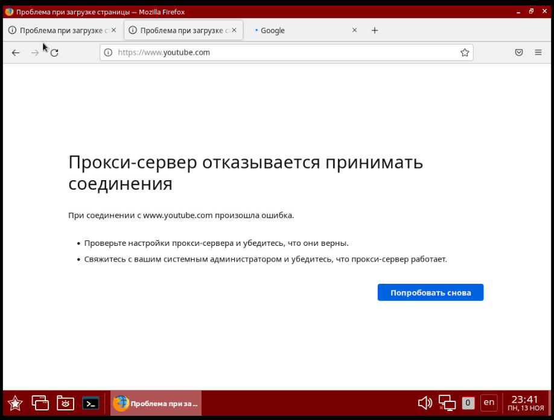

3.  ## Веб сервер на основе Apache

    1.  > Установите Apache на _server (или убедитесь, что он установлен)

        Установлен, тк есть папка с конфигами в `/etc/`
    2.  > Выключите режим AstraMode в файле /etc/apache2/apache2.conf

        ```bash
        sudo nano /etc/apache2/apache2.conf
        ```

    3.  > Настройте конфигурационный файл следующим образом:
        >
        > Имя сервера: «Ваши инициалы».localnet.miet.stu,
        >
        > адрес администратора: «Ваши инициалы»@miet.stu,
        >
        > директория для расположения документов /var/www/«Ваши инициалы»

        Имя сервера: aak.localnet.miet.stu,

        адрес администратора: aak@miet.stu,

        директория для расположения документов /var/www/aak

        ```bash
        sudo cp 000-default.conf aak.localnet.miet.stu.conf
        ```

        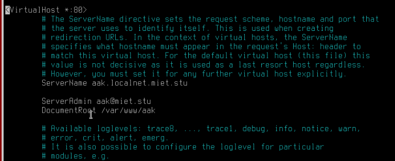

    4.  > Создайте каталог /var/www/«Ваши инициалы» для размещения веб страниц.

        ```bash
        sudo mkdir /var/www/aak
        ```

    5.  > Разместите в созданном каталоге веб страницу со следующим содержимым:

        ```html
        <html>
          <head>
            <title> Welcome to MIET</title>
          </head>
          <body>
            <h1>Welcome to MPSU</h1>
            <p>Hello! I love MPSU!</p>
          </body>
        </html>
        ```

    6.  > Активируйте сайт и перечитайте конфигурацию веб-сервера

        ```bash
        sudo /sbin/a2ensite aak.localnet.miet.stu
        sudo systemctl reload apache2
        ```

    7.  > Проверьте созданную страницу в браузере.

        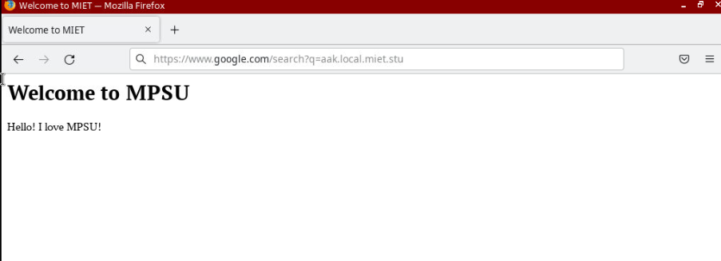

    8.  > Добавьте созданную страницу в список записей DNS и откройте её с машины клиента,
        > используя доменное имя

        Добавим запись в `/etc/bind/named.local.conf`:

        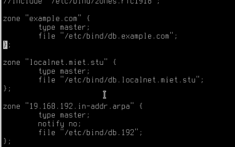

        Добавим запись в `/etc/bind/db.localnet.miet.stu`:

        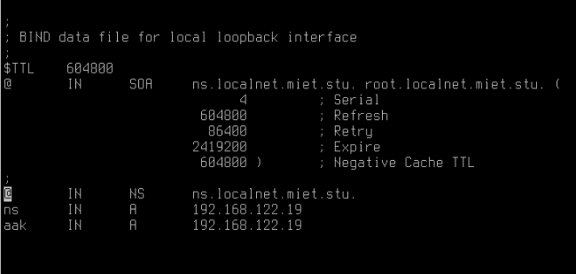

        ```bash
        sudo /etc/init.d/bind9 restart
        ```

        Добавим в *squid* возможность *серверу* отвечать на запросы:

        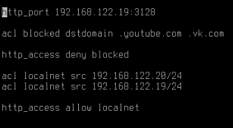

        ```bash
        sudo systemctl reload squid
        ```

        Теперь сайт должен находиться на *клиенте*.
