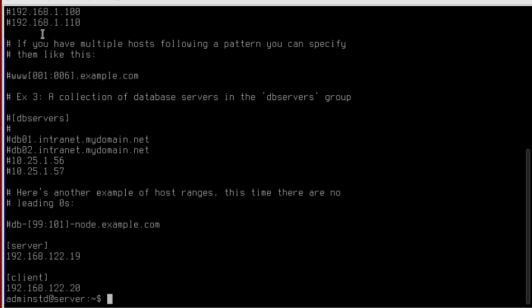
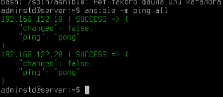
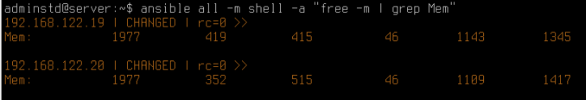

# Лабораторная работа №5 по АЛВС

***[TOC]***

1.  [Задание 1](#задание-1)
1.  [Задание 2](#задание-2)
1.  [Задание 3](#задание-3)
1.  [Задание 4](#задание-4)

---

1.  ## Задание 1.

    > Настройте ansible на серверной машине. В качестве клиентов выберете обе машины
    > – сервер и клиент.

    Внесем ip машин в файл `/etc/ansible/hosts`:

    

2.  ##  Задание 2.

    > Проверьте доступность всех устройств с помощью команды ping используя запуск скрипта ansible

    **КОД**:

    ```bash
    ansible -m ping all
    ```

    **OUTPUT**:

    

    **ВЫВОД**: Все машины доступны.

3.  ## Задание 3.

    > Используя ansible, запустите на машине клиента скрипт, выводящий объем
    > свободной оперативной машины

    **КОД**:

    ```bash
    ansible all -m shell -a "free -m | grep Mem"
    ```

    Здесь:

    *   `free -m`          - Вывести свободную память в мегабайтах
    *   `grep Mem`         - Взять только *mem*, не *swap*

    **OUTPUT**:

    

    Смотрим на 4ую колонку.

4.  ## Задание 4.

    > Создайте playbook, выполняющий следующие задания:

    1.  > Создайте директории ServerВАШИИНИЦИАЛЫ на сервере и ClientВАШИИНИЦИАЛЫ на машине клиента
        > соответственно. Данные директории создаются в домашней директории пользователя.

        ```yaml
        - name: create ServerAAK directory on servers
          file:
            path: "~/ServerAAK"
            state: directory
        ```

    2.  > Создайте файлы с названием info в домашней директории. Добавьте проверку на существование
        > файла. В случае его наличия файл повторно не создается.

        ```yaml
        - name: create Server's info
          copy:
            dest: "~/info"
            force: no
            content: ""
        ```

        Для того, чтобы удостовериться, что файл не создается повторно можно проверить *время
        модификации* файла до и после повторного вызова *playbook* (команда `stat`). Кроме того,
        при изменении (создании файла) *ansible* пишет *changed*, а если он ничего не
        делает с файлом, то пишет *ok*.

    3.  > Заполните данные файлы информацией о системе, включающей в себя имя машины, вашу
        > фамилию, ip адрес, объем занятой оперативной памяти (в Mb),
        > среднюю нагрузку на последние 15 минут работы (см. файл /proc/loadavg).
        > Формат записи: astra001 | Ivanov | 192.168.122.1 | 722 | 1.58

        ```yaml
        - name: get server's info
          shell: "hostname; echo Kharlamov; hostname -I | awk '{print $1}'; free -m | awk 'NR==2 {print $3}'; cat /proc/loadavg | awk '{print $3}'"
          register: system_info
        ```

        <!-- ```bash
        hostname -I | awk '{print $1}'
        cat /proc/loadavg | awk '{print $3}'
        free -m | awk 'NR==2 {print $3}';
        ``` -->

    4.  > Скопируйте данный файл в созданную в п. 1.1 директорию.

        ```yaml
        - name: Copy Server's info to directory
          copy:
            src: "~/info"
            dest: "~/ServerAAK"
            remote_src: yes
        ```

    5.  > Измените в перемещенном файле значение вашей фамилии на ваше имя.

        ```yaml
        - name: Replace surname Server
          replace:
            path: "~/ServerAAK/info"
            regexp: 'Kharlamov'
            replace: 'Alex'
        ```

    6.  > В зависимости от значения нагрузки в файле выведите сообщение на экран.
        > Если нагрузка больше 1: state NAME_MACHINE bad. Если меньше 1, то state NAME_MACHINE good.

        *BAD*:

        ```yaml
        - name: Display load bad Server
          debug:
            msg: "state {{ system_info.stdout_lines[0] }} bad"
          when: (system_info.stdout_lines[0] | float) > 1
        ```

        *GOOD*:

        ```yaml
        - name: Display load good Server
          debug:
            msg: "state {{ system_info.stdout_lines[0] }} good"
          when: (system_info.stdout_lines[0] | float) <= 1
        ```
